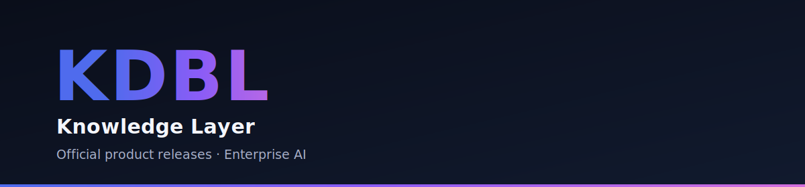

<p align="center">
  
</p>

<p align="center">
  <a href="LICENSE.md"></a>
  
  <a href="https://kdbl.co.uk"></a>
</p>

# KDBL Knowledge Layer — Releases

This is the **official distribution channel** for the KDBL Knowledge Layer. Here you can:

- **Pull official product releases** — versioned container images and customer-facing release notes.
- **Report issues** — through this repository's issue tracker.
- **Receive product updates** — watch this repository to be notified of every new release.

> The KDBL Knowledge Layer indexes your enterprise content across object stores and file shares and makes it searchable and citable — by your people and by AI assistants — with security trimming, grounded citations, and full auditability. Learn more at **[kdbl.co.uk](https://kdbl.co.uk)**.

## Official releases

Every release is published here with **release notes** (see the [Releases](../../releases) tab) and a set of versioned **container images** on the GitHub Container Registry (GHCR):

| Image | Purpose |
| --- | --- |
| `ghcr.io/kdbl-consulting/kdbl-worker` | Core service image — runs the API, indexing workers, metadata workers, extraction host, and operator CLI (selected by command) |
| `ghcr.io/kdbl-consulting/kdbl-ui` | Operator web console |
| `ghcr.io/kdbl-consulting/docling-extractor` | Content extractor (CPU) |
| `ghcr.io/kdbl-consulting/docling-extractor-cuda` | Content extractor (GPU / CUDA) |

> The API and the worker/metadata/extraction services share the single `kdbl-worker` image and are selected at runtime by the container command — there is no separate API image.

Releases follow [semantic versioning](https://semver.org) (`MAJOR.MINOR.PATCH`). Each stable release moves the `latest` and `MAJOR.MINOR` tags; pre-releases publish only their exact version.

```bash
# Pull a specific release (example)
docker pull ghcr.io/kdbl-consulting/kdbl-worker:1.0.0
```

> **Early access:** during onboarding these packages are private. If you are an evaluation or licensed customer and need pull access, please contact your KDBL representative or [get in touch](https://kdbl.co.uk). Deployment guidance is provided with your engagement.

## Reporting issues

Please raise product issues through this repository's **[Issues](../../issues)** tab. Include the product version, your environment, and clear steps to reproduce.

**Security vulnerabilities:** please report them responsibly and privately to **security@kdbl.co.uk** — do **not** open a public issue for security matters. See [Terms of Use](TERMS.md) for our disclosure process.

## Product updates

Choose **Watch → Custom → Releases** on this repository to be notified of every new release. Each release's notes summarise what's new, improved, and fixed.

## Security

We take supply-chain security seriously:

- **Daily vulnerability scans** of every published image (Trivy) — see the rolling [security report](SECURITY-REPORT.md).
- **SBOM + build provenance** attached to each image.
- **Image signing** (cosign) — *in progress*.

Report a vulnerability privately to **security@kdbl.co.uk** — see our [Security Policy](SECURITY.md). Please don't open a public issue for security matters.

## Licence &amp; terms

The KDBL Knowledge Layer and all related software, container images, and materials are **proprietary** and **licensed, not sold**. Your use is governed by:

- the **[Commercial Software Licence Agreement](LICENSE.md)**, and
- the **[Terms of Use](TERMS.md)** of this repository.

By downloading, installing, accessing, or using any KDBL software, you agree to those terms. If you do not agree, do not use the software.

## About KDBL

**KDBL Consulting Limited** is a specialist enterprise AI consultancy and Microsoft Partner, delivering agentic AI systems, Copilot integrations, and production-grade AI solutions.

- Website: **[kdbl.co.uk](https://kdbl.co.uk)**
- Registered in England &amp; Wales, company number **15430964**
- Registered office: Bartle House, Oxford Court, Manchester, United Kingdom, M2 3WQ

<sub>© KDBL Consulting Limited. All rights reserved. "KDBL" and the KDBL logo are trade marks of KDBL Consulting Limited.</sub>
